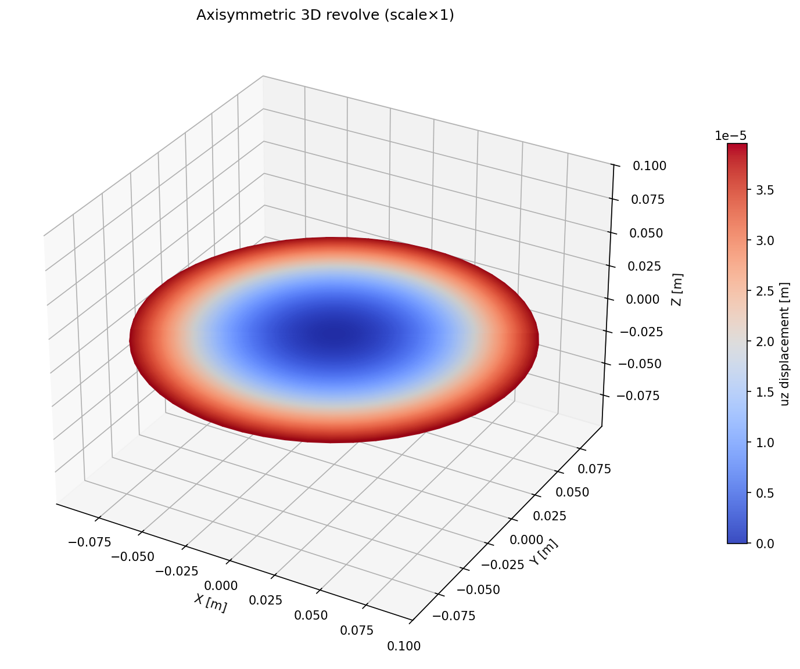

# FemSolver

간단한 FEM(유한요소법) Solver를 파이썬으로 구현한 프로젝트입니다.



## 구현된 요소

- 선형 탄성 해석 (1D, 2D)
- 선형 열 해석 (1D, 2D)
- 비선형 탄성 해석 (1D, 2D)

## 사용 방법

### 1. 일반적인 문제 (기제작된 Mesh 필요)

#### 1) Mesh 작성

`examples/*.yaml` 형식을 참고하여 Mesh를 YAML 형태로 작성합니다. (현재 자동 변환은 불가능)

#### 2) 해석 실행

```bash
python solve.py -i examples/simple_truss.yaml -o test_out.yaml --vtk
```

#### 3) 결과 확인

**정석 버전:** 생성된 `test_out.vtu` 파일을 [ParaView](https://www.paraview.org/)와 같은 소프트웨어로 열어서 확인합니다.

**간단한 버전:** 생성된 `test_out.yaml` 파일을 아래 명령어로 간단하게 시각화할 수 있습니다. (`test_img.png` 파일에 저장됨)

```bash
python visualize.py -i examples/simple_truss.yaml -r test_out.yaml -o test_img.png
```

---

### 2. 축대칭 Warpage 문제 (Film과 Substrate의 물성만 알면 됨)

#### 1) YAML 파일 생성

```bash
python tools/generate_warpage_config.py \
  --h_f 1e-6 --h_s 500e-6 --R 1e-1 \
  --E_f 200e9 --E_s 130e9 --nu_f 0.3 --nu_s 0.28 \
  --alpha_f 14e-6 --alpha_s 2.6e-6 \
  --temp_init 400 --temp_final 25 \
  -o examples/warpage_input.yaml
```

#### 2) 해석 실행

```bash
python solve.py -i examples/warpage_input.yaml -o test_out.yaml --vtk
```

#### 3) 결과 확인

**정석 버전:** 생성된 `test_out.vtu` 파일을 [ParaView](https://www.paraview.org/)와 같은 소프트웨어로 열어서 확인합니다.

**간단한 버전:** 생성된 `test_out.yaml` 파일을 아래 명령어로 간단하게 시각화할 수 있습니다. (`test_img.png` 파일에 저장됨)

```bash
python visualize.py -i examples/warpage_input.yaml -r test_out.yaml -o test_img.png --revolve
```

#### 4) Stoney 이론값과 비교

해석 결과를 Stoney 방법(이론값)과 비교할 수 있습니다.

```bash
python tools/postprocess_warpage.py -i examples/warpage_input.yaml -r test_out.yaml
```
